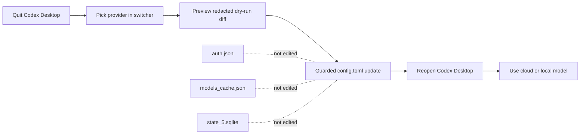
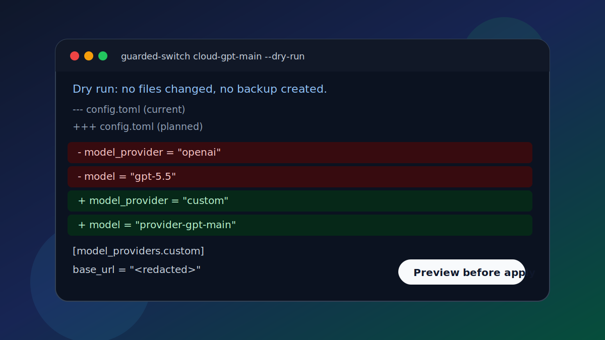

# Codex Hybrid Model Switcher

[](https://github.com/viezhukai-stack/codex-hybrid-model-switcher/actions/workflows/ci.yml)
[](pyproject.toml)
[](LICENSE)
[](https://github.com/viezhukai-stack/codex-hybrid-model-switcher/releases)

Cross-platform tooling for using Codex Desktop with:

- official OpenAI/Codex account state preserved
- OpenAI-compatible cloud providers configured by the user
- local llama.cpp models, including multimodal GGUF + mmproj models
- CC Switch-style provider switching outside Codex's bottom-right model menu

The project is intentionally conservative. It does not edit `models_cache.json`,
does not mutate Codex session history, and does not install KeepAlive services.

## 3-Minute Tour

**Codex Hybrid Model Switcher lets you switch Codex Desktop between official,
cloud, and local model providers while keeping account files, plugin/MCP
settings, model cache, and session history out of the blast radius.**

It is built for users who want external model choice without hand-editing fragile
Codex Desktop state. The switcher writes only guarded provider settings to
`config.toml`, shows a redacted dry-run diff first, backs up before real writes,
and verifies protected Codex files after the switch.



Start here:

- Hand this repo to Codex: [`docs/agent-assisted-setup.md`](docs/agent-assisted-setup.md)
- New user walkthrough in Chinese: [`docs/tutorial.zh-CN.md`](docs/tutorial.zh-CN.md)
- Beginner first-run wizard: [`docs/first-run-wizard.md`](docs/first-run-wizard.md)
- Setup intake checklist: [`docs/setup-intake.md`](docs/setup-intake.md)
- Safe English demo without touching a real profile: [`docs/quickstart-demo.md`](docs/quickstart-demo.md)
- Visual demo gallery: [`docs/demo-gallery.md`](docs/demo-gallery.md)
- Windows click-through user flow: [`docs/windows-user-flow.md`](docs/windows-user-flow.md)
- Optional local llama.cpp smoke test: [`docs/local-llama-smoke.md`](docs/local-llama-smoke.md)

Use it when you want OpenAI-compatible cloud providers, local llama.cpp models,
or a recoverable switching workflow. Do not use it to patch Codex's native model
cache, rewrite old conversations, or install always-on recovery services.



## Compatibility

| Platform | Status | Notes |
| --- | --- | --- |
| macOS | Supported | Cloud and local workflows are documented; real switching should still use guarded dry-runs first. |
| Windows | Supported | Guarded launcher and canary workflows are documented. |
| Linux | Unverified | The core Python package may run, but Codex Desktop integration is not a primary target yet. |

## Safety Model

- Treat the external switcher as the source of truth.
- Quit Codex Desktop before switching providers.
- Keep project history unified under the `custom` provider bucket.
- Keep API keys outside the repository. Use environment variables or your local
  provider manager.
- Route local models through the bridge on `127.0.0.1:19030`; the raw
  llama.cpp server stays behind it on `127.0.0.1:19031`.

## Quick Start

If you want Codex itself to configure this project for you, open this repository
in Codex and start with [`docs/agent-assisted-setup.md`](docs/agent-assisted-setup.md).
The root `AGENTS.md` file tells Codex how to proceed safely.

1. Install locally:

   ```sh
   python3 -m pip install -e .
   ```

2. Run the first-run wizard. It creates a private config only; it does not
   switch Codex Desktop:

   ```sh
   codex-hybrid-switcher setup
   ```

   Non-interactive example for scripts or tests:

   ```sh
   codex-hybrid-switcher setup --non-interactive \
     --base-url https://YOUR-OPENAI-COMPATIBLE-ENDPOINT.example/v1 \
     --model provider-gpt-main \
     --api-key-env OPENAI_COMPATIBLE_API_KEY
   ```

3. Or copy an example config manually:

   ```sh
   codex-hybrid-switcher init-config --platform macos --output ~/.codex-hybrid-model-switcher/config.json
   ```

4. Edit paths and provider endpoints in that private config if needed.

5. Check the environment:

   ```sh
   codex-hybrid-switcher validate-config --config ~/.codex-hybrid-model-switcher/config.json
   ```

6. Preview the Codex config change without writing anything:

   ```sh
   codex-hybrid-switcher guarded-switch cloud-gpt-main --dry-run --config ~/.codex-hybrid-model-switcher/config.json
   ```

7. For a real cloud switch, quit Codex Desktop completely, then use guarded
   apply:

   ```sh
   codex-hybrid-switcher guarded-switch cloud-gpt-main --config ~/.codex-hybrid-model-switcher/config.json
   ```

8. Test local models only on machines that have suitable hardware, llama.cpp,
   and model files:

   ```sh
   codex-hybrid-switcher local-smoke --config ~/.codex-hybrid-model-switcher/config.json
   ```

9. Switch to a local provider only after local smoke passes:

   ```sh
   codex-hybrid-switcher guarded-switch local-gemma --allow-local --config ~/.codex-hybrid-model-switcher/config.json
   ```

## User Paths

- Cloud provider path: initialize a private config, validate it, run
  `guarded-switch --dry-run`, then quit Codex Desktop before applying a real
  cloud-provider switch.
- Windows beginner path: use the guarded Windows launcher after the canary
  checks pass. The launcher should ask the user to close Codex before it writes
  `config.toml`.
- Optional local llama.cpp path: run `local-smoke` first. Only switch Codex to a
  local provider after text and, for multimodal models, image smoke tests pass
  on that machine.
- Recovery path: quit Codex Desktop and restore the newest
  `config.toml.bak-codex-hybrid-*` backup. This project is designed not to edit
  `auth.json`, `models_cache.json`, `state_5.sqlite`, or session history.

For release history and project rules, see `CHANGELOG.md`, `SECURITY.md`,
`CONTRIBUTING.md`, and `ROADMAP.md`.

For common setup and recovery questions, see `docs/faq.md`.

## Documentation

- Agent-assisted setup: [`docs/agent-assisted-setup.md`](docs/agent-assisted-setup.md)
- Setup intake checklist: [`docs/setup-intake.md`](docs/setup-intake.md)
- Chinese tutorial: [`docs/tutorial.zh-CN.md`](docs/tutorial.zh-CN.md)
- English quickstart demo: [`docs/quickstart-demo.md`](docs/quickstart-demo.md)
- Visual demo gallery: [`docs/demo-gallery.md`](docs/demo-gallery.md)
- Safety model: [`docs/safety.md`](docs/safety.md)
- First-run wizard: [`docs/first-run-wizard.md`](docs/first-run-wizard.md)
- Recovery guide: [`docs/recovery.md`](docs/recovery.md)
- Windows beginner flow: [`docs/windows-user-flow.md`](docs/windows-user-flow.md)
- Local llama.cpp smoke test: [`docs/local-llama-smoke.md`](docs/local-llama-smoke.md)
- Roadmap: [`ROADMAP.md`](ROADMAP.md)
- Release post kit: [`docs/release-post.md`](docs/release-post.md)
- GitHub labels and community setup: [`docs/github-labels.md`](docs/github-labels.md)

## Commands

```sh
python -m codex_hybrid_switcher status
python -m codex_hybrid_switcher doctor
python -m codex_hybrid_switcher doctor --strict
python -m codex_hybrid_switcher init-config --platform macos --output ~/.codex-hybrid-model-switcher/config.json
python -m codex_hybrid_switcher setup
python -m codex_hybrid_switcher setup --non-interactive --base-url https://YOUR-ENDPOINT.example/v1 --model provider-gpt-main
python -m codex_hybrid_switcher validate-config --config ~/.codex-hybrid-model-switcher/config.json
python -m codex_hybrid_switcher bridge
python -m codex_hybrid_switcher local-smoke
python -m codex_hybrid_switcher smoke
python -m codex_hybrid_switcher security-scan .
python -m codex_hybrid_switcher menu
python -m codex_hybrid_switcher switch <provider-id> --dry-run
python -m codex_hybrid_switcher guarded-switch <provider-id> --dry-run
python -m codex_hybrid_switcher guarded-switch local-gemma --allow-local
python -m codex_hybrid_switcher guarded-switch <provider-id>
python -m codex_hybrid_switcher switch <provider-id>
```

## Isolated Install Validation

Before using this project with a real Codex profile, run the isolated validation:

```sh
python3 scripts/validate-install.py
```

It creates a temporary workspace, installs the package, runs tests and security
checks, and exercises `switch --dry-run` against a simulated Codex config. See
`docs/install-validation.md` for macOS and Windows details.

## Private Config Dry-run

After install validation, use `docs/private-config-dryrun.md` to initialize and
validate a machine-local config. The validation output redacts provider hostnames
and local file paths. Stop at `switch --dry-run` until you are ready for a real
Codex provider switch.

For the first real cloud-provider smoke test, use a canary machine and prefer
`guarded-switch` so protected Codex state files are hashed before and after the
switch. Start with `docs/windows-cloud-canary.md` for Windows or
`docs/macos-cloud-switch-smoke.md` for macOS. Do not test local llama.cpp models
in the cloud canary workflow.

After cloud canary verification, use `docs/local-llama-smoke.md` to validate the
local bridge and llama.cpp model before switching Codex Desktop to a local
provider.

For the Windows end-user switching flow after both canaries pass, use
`docs/windows-user-flow.md`.

To repeat the validation on another Windows machine, follow
`docs/windows-second-canary.md` before installing the end-user launcher.

For the current validation coverage and release gate, see
`docs/validation-matrix.md`, `docs/release-checklist.md`, and
`docs/public-release-plan.md`.

## What This Repository Must Not Contain

- `auth.json`
- `models_cache.json`
- `state_5.sqlite`
- API keys, bearer tokens, refresh tokens, or passwords
- personal backups, cleanup quarantine folders, or runtime logs
- machine-specific private paths except inside example placeholders

See `docs/safety.md` before adapting this to a real Codex installation.
