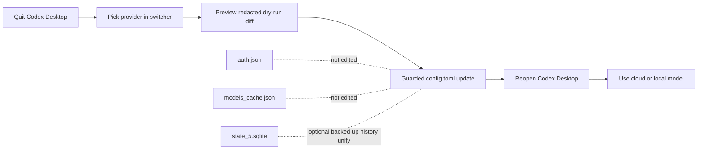
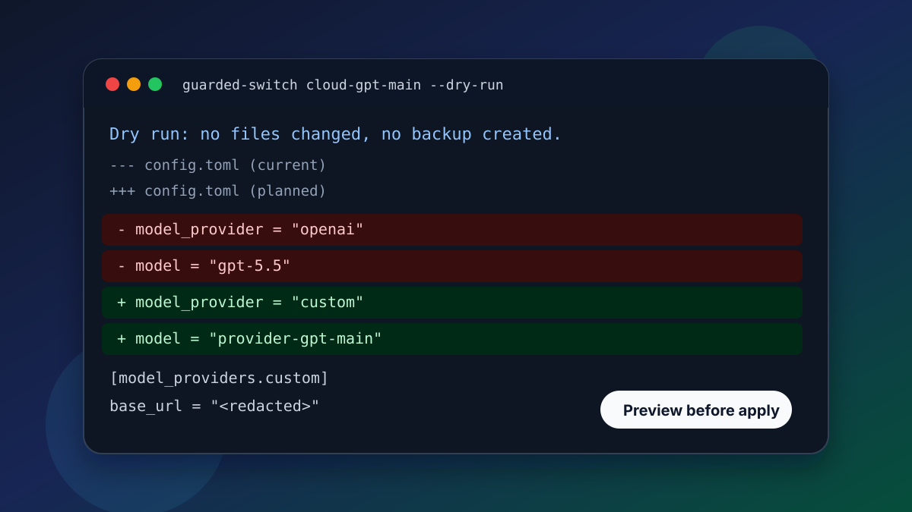

# Codex Hybrid Model Switcher

[](https://github.com/viezhukai-stack/codex-hybrid-model-switcher/actions/workflows/ci.yml)
[](pyproject.toml)
[](LICENSE)
[](https://github.com/viezhukai-stack/codex-hybrid-model-switcher/releases)

Cross-platform tooling for using Codex Desktop with:

- official OpenAI/Codex account state preserved
- OpenAI-compatible cloud providers configured by the user
- local llama.cpp models, including multimodal GGUF + mmproj models
- a 2.0 hot router that uses Codex's model selector for normal cloud/local switching
- a guarded external maintenance switcher and explicit rollback path

The project is intentionally conservative. It does not edit `models_cache.json`
or install KeepAlive services. It only rewrites Codex history when the user
explicitly enables the backed-up history unification step.

## 3-Minute Tour

**Codex Hybrid Model Switcher lets you switch Codex Desktop between official,
cloud, and local model providers while keeping account files, plugin/MCP
settings, model cache, and session history out of the blast radius.**

It is built for users who want external model choice without hand-editing fragile
Codex Desktop state. The switcher writes only guarded provider settings to
`config.toml`, shows a redacted dry-run diff first, backs up before real writes,
and verifies protected Codex files after the switch.


```mermaid
flowchart LR
    A["Quit Codex Desktop"] --> B["Pick provider in switcher"]
    B --> C["Preview redacted dry-run diff"]
    C --> D["Guarded config.toml update"]
    D --> E["Reopen Codex Desktop"]
    E --> F["Use cloud or local model"]

    G["auth.json"] -. "not edited" .- D
    H["models_cache.json"] -. "not edited" .- D
    I["state_5.sqlite"] -. "optional backed-up history unify" .- D
```

Start here:

- If you want to hand the GitHub project to Codex directly:
  [`HANDOFF_TO_CODEX.md`](HANDOFF_TO_CODEX.md)
- If you only have stock Codex Desktop: [`START_HERE.md`](START_HERE.md)
- Windows one-click beginner setup: [`docs/windows-one-click-installer.md`](docs/windows-one-click-installer.md)
- Windows full local package canary: [`docs/windows-full-local-pack-canary.md`](docs/windows-full-local-pack-canary.md)
- macOS one-click beginner setup: [`docs/macos-one-click-installer.md`](docs/macos-one-click-installer.md)
- macOS full local package: [`docs/macos-full-local-pack.md`](docs/macos-full-local-pack.md)
- macOS full local package canary: [`docs/macos-full-local-pack-canary.md`](docs/macos-full-local-pack-canary.md)
- Final self-check after setup: [`FINAL_CHECK.md`](FINAL_CHECK.md)
- Hand this repo to Codex: [`docs/agent-assisted-setup.md`](docs/agent-assisted-setup.md)
- Zero-install bootstrap: [`docs/bootstrap.md`](docs/bootstrap.md)
- New user walkthrough in Chinese: [`docs/tutorial.zh-CN.md`](docs/tutorial.zh-CN.md)
- Beginner first-run wizard: [`docs/first-run-wizard.md`](docs/first-run-wizard.md)
- Setup intake checklist: [`docs/setup-intake.md`](docs/setup-intake.md)
- API key environment variables: [`docs/api-key-environment.md`](docs/api-key-environment.md)
- Bridge health check: [`docs/bridge-health.md`](docs/bridge-health.md)
- Safe English demo without touching a real profile: [`docs/quickstart-demo.md`](docs/quickstart-demo.md)
- Redacted setup report: [`docs/setup-report.md`](docs/setup-report.md)
- Final canary evidence report: [`docs/canary-report.md`](docs/canary-report.md)
- Real clean-machine canary: [`docs/real-clean-machine-canary.md`](docs/real-clean-machine-canary.md)
- Windows Hyper-V clean VM canary: [`docs/windows-hyperv-clean-vm-canary.md`](docs/windows-hyperv-clean-vm-canary.md)
- Windows full local package canary: [`docs/windows-full-local-pack-canary.md`](docs/windows-full-local-pack-canary.md)
- Read-only final check: [`docs/final-check.md`](docs/final-check.md)
- User success criteria: [`docs/user-success-criteria.md`](docs/user-success-criteria.md)
- Agent handoff drill: [`docs/agent-handoff-drill.md`](docs/agent-handoff-drill.md)
- Stock Codex handoff validation: [`docs/stock-codex-handoff-validation.md`](docs/stock-codex-handoff-validation.md)
- Visual demo gallery: [`docs/demo-gallery.md`](docs/demo-gallery.md)
- Windows click-through user flow: [`docs/windows-user-flow.md`](docs/windows-user-flow.md)
- Optional local llama.cpp smoke test: [`docs/local-llama-smoke.md`](docs/local-llama-smoke.md)

Use it when you want OpenAI-compatible cloud providers, local llama.cpp models,
or a recoverable switching workflow. Do not use it to patch Codex's native model
cache, rewrite old conversations, or install always-on recovery services.



## Compatibility

| Platform | Status | Notes |
| --- | --- | --- |
| macOS | Supported | Cloud and local workflows are documented; real switching should still use guarded dry-runs first. |
| Windows | Supported | Guarded launcher and canary workflows are documented. |
| Linux | Unverified | The core Python package may run, but Codex Desktop integration is not a primary target yet. |

## Safety Model

- Treat the external switcher as the source of truth.
- Quit Codex Desktop before switching providers.
- Keep project history unified under the `custom` provider bucket.
- Keep API keys outside the repository. Use environment variables or your local
  provider manager.
- For beginner cloud setup, route Codex through the bridge on
  `127.0.0.1:19030`; the bridge forwards to the real OpenAI-compatible provider
  using the configured `api_key_env`.
- Route local models through the same bridge on `127.0.0.1:19030`; the raw
  llama.cpp server stays behind it on `127.0.0.1:19031`.

## Quick Start

### Windows full local one-click setup

For a beginner Windows computer, share
`Codex-Hybrid-Windows-Full-Local-Setup-v2.18.8.zip`, extract the entire zip,
and double-click `Install Codex Hybrid.cmd`. This is the recommended netdisk
package because it includes the local model path and does not require a cloud
API key.

The installer can open the official Codex app page when Codex is missing,
use bundled portable Python, use the bundled project payload without GitHub
project download, prefill provider settings from `provider-preset.json`,
download official llama.cpp release assets when local model files are selected,
install desktop launchers for the guarded switcher, official restore, and the
Windows hot router, and stop at guarded dry-run before asking for an explicit
`APPLY` confirmation. It does not redistribute Codex Desktop, install CC
Switch, or apply a real switch without explicit confirmation.

Windows v2.18.8 also installs four explicit maintenance entries. `Repair Codex
Update and Plugins.cmd` completes a staged official Store registration and
aligns the matching CLI and Browser/Chrome path. On Codex CLI `0.149.0` and
newer, `openai-bundled` is Desktop-owned, so the updater preserves it instead
of trying to remove or re-add the reserved marketplace; older CLIs retain the
explicit marketplace refresh. `Repair Codex Browser and CLI.cmd` copies the
matching complete CLI companion set and repairs the current-user
`CODEX_CLI_PATH` after a Codex app update, including the case where the app
regenerates its Browser config block. `Repair Codex Live Audio.cmd`
diagnoses microphone consent and default recording roles, remains read-only until
the user types `REPAIR`, and keeps a timestamped `RESTORE` backup. `Change Codex
Account.cmd` uses device-code login with a local transaction backup. The normal
routing workflow still leaves account files untouched.

See [`docs/windows-live-audio-repair.md`](docs/windows-live-audio-repair.md) for
the Live audio doctor, explicit repair, and rollback behavior.

The daily `Start Codex Hot Router.cmd` entry performs the complete closed-app
update transaction automatically. When Windows has staged a newer Codex AppX,
it first waits for three identical Store observations, registers the staged
version, then waits and checks again for a second staged build. It allows at
most two registration passes, validates and hashes all five CLI bundle files,
and checks Browser/Chrome before opening the app. For CLI `0.149.0+`, reserved
marketplace alignment is deferred to Codex Desktop; legacy CLIs keep the
explicit pre-start marketplace refresh. A healthy installation takes the fast
path; if Store versions keep changing, Codex stays closed and the explicit
repair entry remains available.

If Microsoft Store registration is temporarily offline but the official newer
package is already staged on disk, v2.18.8 registers that local official
package for the current user and continues the same guarded transaction. The
desktop entry now calls a stable launcher that discovers the newest valid
installed Hybrid release instead of embedding one release directory forever.

The update transaction checks whether Windows has staged a newer Codex AppX
package for registration and completes that registration through the official
Microsoft Store product before proceeding. If registration, CLI validation, or
plugin refresh fails, the old app stays closed and a private timestamped
backup is left for recovery. Every packaged Windows entry self-heals portable
Python's `python312._pth` file so it imports the current release instead of a
surviving older release directory.

After Codex opens, the same daily entry runs one bounded Browser check in the
background as a final feature-initialization verification. It does nothing when
the official Browser plugin is healthy and never restarts Codex. With a
Desktop-owned `openai-bundled` marketplace, this check observes the app-owned
state without issuing marketplace remove/add commands. No service, scheduled
task, watchdog, or recovery loop is installed.

The full local package can include `payload/models/local-gemma`,
`payload/llama.cpp`, and `payload/vcredist/vc_redist.x64.exe` so a beginner can
use the bundled local Gemma model without a cloud API key. The large model files
are never committed to GitHub.
The default local model id remains the generic `local/gemma`; machine-specific
model ids such as larger private Gemma variants belong only in that machine's
private config.
If the user enables history unification, the installer backs up
`state_5.sqlite` and matching `sessions/*.jsonl` files before moving existing
`openai` project chats into the `custom` bucket and active model so they remain
visible after switching.

See [`docs/windows-one-click-installer.md`](docs/windows-one-click-installer.md).

### macOS full local one-click setup

For a beginner Mac computer, share
`Codex-Hybrid-macOS-Full-Local-Setup-v2.18.8.zip`, extract the entire zip, and
double-click `Install Codex Hybrid.command`. This is the recommended netdisk
package because it includes both macOS x64 and arm64 llama.cpp runtimes plus
`payload/models/local-gemma`, so a beginner can use the bundled local Gemma
model without a cloud API key. The large model files are never committed to
GitHub.
Current macOS Codex builds may appear as `ChatGPT.app`; the macOS installer and
launchers discover bundle id `com.openai.codex` first, then keep explicit
`ChatGPT.app` and legacy `Codex.app` paths as fallbacks.
After installation, normal daily use starts from
`Start Codex Hybrid 2.0.command`. It checks the lightweight bridge, starts the
hot router on `127.0.0.1:19032`, and then opens ChatGPT/Codex. The old
`Codex Model Switcher.command` remains available only for maintenance and
rollback work.
If the user enables history unification, the installer backs up
`state_5.sqlite` and matching `sessions/*.jsonl` files before moving existing
`openai` project chats into the `custom` bucket and active model so they remain
visible after switching. Python 3.10+ is required; macOS packages do not bundle
Python by default, but the builder can include a tested runtime under
`payload/python`.

See [`docs/macos-full-local-pack.md`](docs/macos-full-local-pack.md).
The v2.17.3 full-local flow and v2.18.0 upgrade path have real Mac UI canaries recorded in
[`docs/macos-full-local-pack-canary.md`](docs/macos-full-local-pack-canary.md);
the current v2.18.8 package carries the same app-discovery path plus the shared
Responses/tool-call preservation fix and HTTP/1.1 WebSocket tunneling used by
Codex Live voice.

### 2.0 hot-router configuration

Private configs may define the shared Mac/Windows hot router:

```json
{
  "hot_router": {
    "host": "127.0.0.1",
    "port": 19032,
    "default_cloud_provider_id": "cloud-gpt-main",
    "hidden_model_ids": [],
    "visible_model_ids": [],
    "model_aliases": {},
    "model_display_names": {},
    "catalog_cache_seconds": 15,
    "max_429_retries": 2,
    "max_retry_after_seconds": 30,
    "ignore_system_proxy": false
  }
}
```

The cloud catalog is dynamic unless an explicit private `visible_model_ids`
allowlist is configured. A non-empty allowlist is strict for both cloud and
local catalog entries, so every intended local model must also be listed. An
explicitly allowlisted entry is normalized to `visibility = "list"`, preventing
an upstream `visibility = "hide"` flag from silently removing it in Codex
Desktop.
`model_display_names` can rename catalog labels without changing the model id
sent upstream. Newly published models route through `default_cloud_provider_id`;
model-specific provider entries still take precedence.
On Windows machines that use a TUN proxy and have a stale system-proxy entry,
set `ignore_system_proxy` to `true`; only the Hot Router process bypasses that
system entry.

Machines whose local bridge exposes more than one model may add a private
`local_catalog_models` array. Each item supplies catalog-only metadata such as
`id`, `display_name`, `context_window`, and `input_modalities`; the existing
singular `local_model` block remains the llama.cpp runtime configuration.

The bounded 429 settings apply to cloud and local response forwarding. The
Gemini High compatibility path requests one non-streaming upstream response and
reconstructs a complete Responses event stream while preserving message,
reasoning, function-call, usage, and terminal-status items. Because that
upstream can occasionally return HTTP 200 with an empty `output`, this one shim
also retries an empty successful response at most twice before returning it.

Codex Live voice creates a session with `POST /v1/live` and then upgrades to a
Realtime WebSocket. The shared Hot Router accepts the HTTP/1.1 upgrade on the
same port and tunnels it to the configured cloud provider. Router logs retain
only route, status, and byte-count metadata; audio and WebSocket frame contents
remain outside the log.

When the cloud endpoint is behind Nginx, its proxy location must also preserve
the upgrade hop. A typical configuration is:

```nginx
map $http_upgrade $connection_upgrade {
    default upgrade;
    ''      close;
}

location / {
    proxy_pass http://YOUR_UPSTREAM;
    proxy_http_version 1.1;
    proxy_set_header Upgrade $http_upgrade;
    proxy_set_header Connection $connection_upgrade;
    proxy_read_timeout 3600s;
    proxy_send_timeout 3600s;
}
```

If you want Codex itself to configure this project for you, open this repository
in Codex and start with [`START_HERE.md`](START_HERE.md). The root `AGENTS.md`
file tells Codex how to proceed safely.

1. Run bootstrap directly from the repository. It creates a private config,
   validates it, and runs guarded dry-run without installing the package first:

   ```sh
   python3 bootstrap.py
   ```

   Non-interactive bootstrap example:

   ```sh
   python3 bootstrap.py --non-interactive \
     --base-url https://YOUR-OPENAI-COMPATIBLE-ENDPOINT.example/v1 \
     --model provider-gpt-main \
     --api-key-env OPENAI_COMPATIBLE_API_KEY \
     --cloud-route bridge
   ```

   `bridge` is the beginner default: Codex talks to `127.0.0.1:19030`, and the
   bridge reads the API key from the environment variable. Use
   `--cloud-route direct` only for providers known to support direct Codex
   custom-provider auth.

2. Optionally install locally if you prefer the `codex-hybrid-switcher` command:

   ```sh
   python3 -m pip install -e .
   ```

3. Run the first-run wizard. It creates a private config only; it does not
   switch Codex Desktop:

   ```sh
   codex-hybrid-switcher setup
   ```

   Non-interactive example for scripts or tests:

   ```sh
   codex-hybrid-switcher setup --non-interactive \
     --base-url https://YOUR-OPENAI-COMPATIBLE-ENDPOINT.example/v1 \
     --model provider-gpt-main \
     --api-key-env OPENAI_COMPATIBLE_API_KEY
   ```

4. Or copy an example config manually:

   ```sh
   codex-hybrid-switcher init-config --platform macos --output ~/.codex-hybrid-model-switcher/config.json
   ```

5. Edit paths and provider endpoints in that private config if needed.

6. Check the environment:

   ```sh
   codex-hybrid-switcher validate-config --config ~/.codex-hybrid-model-switcher/config.json
   ```

7. If validation shows `api_key_env(...unset)`, print safe setup instructions:

   ```sh
   codex-hybrid-switcher env-help --config ~/.codex-hybrid-model-switcher/config.json
   ```

   This command does not read, print, or store API keys.

8. For `route=bridge`, check whether the local bridge is already healthy:

   ```sh
   codex-hybrid-switcher bridge-health --config ~/.codex-hybrid-model-switcher/config.json
   ```

   A closed bridge port before the real switch is not automatically a failure:
   guarded apply can start the managed bridge. If Codex opens but a test chat
   does not reply, run this command again to see whether the bridge, key, or
   model list is the problem.

9. Preview the Codex config change without writing anything:

   ```sh
   codex-hybrid-switcher guarded-switch cloud-gpt-main --dry-run --config ~/.codex-hybrid-model-switcher/config.json
   ```

10. For a real cloud switch, quit Codex Desktop completely, then use guarded
   apply:

   ```sh
   codex-hybrid-switcher guarded-switch cloud-gpt-main --config ~/.codex-hybrid-model-switcher/config.json
   ```

11. Test local models only on machines that have suitable hardware, llama.cpp,
   and model files:

   ```sh
   codex-hybrid-switcher local-smoke --config ~/.codex-hybrid-model-switcher/config.json
   ```

12. Switch to a local provider only after local smoke passes:

   ```sh
   codex-hybrid-switcher guarded-switch local-gemma --allow-local --config ~/.codex-hybrid-model-switcher/config.json
   ```

13. Generate a redacted setup report after a real switch:

   ```sh
   codex-hybrid-switcher setup-report --config ~/.codex-hybrid-model-switcher/config.json --output ~/Desktop/codex-hybrid-setup-report.md
   ```

14. After visually confirming Codex Desktop account, plugins/MCP, project list,
    and a responding test chat, generate a final canary evidence report:

   ```sh
   codex-hybrid-switcher canary-report --config ~/.codex-hybrid-model-switcher/config.json --provider-id cloud-gpt-main --account-visible yes --plugins-visible yes --mcp-visible yes --project-list-visible yes --test-chat-responded yes --bridge-health-passed yes --setup-report-reviewed yes --verdict complete --output ~/Desktop/codex-hybrid-canary-evidence.md
   ```

15. Generate the real clean-machine canary checklist for field testing:

   ```sh
   codex-hybrid-switcher real-canary-template --config ~/.codex-hybrid-model-switcher/config.json --provider-id cloud-gpt-main --setup-report ~/Desktop/codex-hybrid-setup-report.md --canary-report ~/Desktop/codex-hybrid-canary-evidence.md --output ~/Desktop/codex-hybrid-real-clean-machine-canary.md
   ```

16. Generate the read-only final verdict report:

   ```sh
   codex-hybrid-switcher final-check --config ~/.codex-hybrid-model-switcher/config.json --setup-report ~/Desktop/codex-hybrid-setup-report.md --canary-report ~/Desktop/codex-hybrid-canary-evidence.md --real-canary-template ~/Desktop/codex-hybrid-real-clean-machine-canary.md --output ~/Desktop/codex-hybrid-final-check.md
   ```

## User Paths

- Cloud provider path: initialize a private config, validate it, run
  `guarded-switch --dry-run`, then quit Codex Desktop before applying a real
  cloud-provider switch.
- Windows beginner path: use the guarded Windows launcher after the canary
  checks pass. The launcher should ask the user to close Codex before it writes
  `config.toml`.
- Optional local llama.cpp path: run `local-smoke` first. Only switch Codex to a
  local provider after text and, for multimodal models, image smoke tests pass
  on that machine.
- Recovery path: quit Codex Desktop and restore the newest
  `config.toml.bak-codex-hybrid-*` backup. If history unification was enabled,
  restore the newest `state_5.sqlite.bak-codex-hybrid-*` backup as well.
  This project is designed not to edit `auth.json` or `models_cache.json`.

For release history and project rules, see `CHANGELOG.md`, `SECURITY.md`,
`CONTRIBUTING.md`, and `ROADMAP.md`.

For common setup and recovery questions, see `docs/faq.md`.

## Documentation

- Agent-assisted setup: [`docs/agent-assisted-setup.md`](docs/agent-assisted-setup.md)
- Stock Codex handoff prompt: [`START_HERE.md`](START_HERE.md)
- Final agent check prompt: [`FINAL_CHECK.md`](FINAL_CHECK.md)
- Setup intake checklist: [`docs/setup-intake.md`](docs/setup-intake.md)
- API key environment variables: [`docs/api-key-environment.md`](docs/api-key-environment.md)
- Bridge health check: [`docs/bridge-health.md`](docs/bridge-health.md)
- Bootstrap entry: [`docs/bootstrap.md`](docs/bootstrap.md)
- Setup report: [`docs/setup-report.md`](docs/setup-report.md)
- Canary evidence report: [`docs/canary-report.md`](docs/canary-report.md)
- Real clean-machine canary: [`docs/real-clean-machine-canary.md`](docs/real-clean-machine-canary.md)
- Windows Hyper-V clean VM canary: [`docs/windows-hyperv-clean-vm-canary.md`](docs/windows-hyperv-clean-vm-canary.md)
- Read-only final check: [`docs/final-check.md`](docs/final-check.md)
- User success criteria: [`docs/user-success-criteria.md`](docs/user-success-criteria.md)
- Agent handoff drill: [`docs/agent-handoff-drill.md`](docs/agent-handoff-drill.md)
- Stock Codex handoff validation: [`docs/stock-codex-handoff-validation.md`](docs/stock-codex-handoff-validation.md)
- Chinese tutorial: [`docs/tutorial.zh-CN.md`](docs/tutorial.zh-CN.md)
- English quickstart demo: [`docs/quickstart-demo.md`](docs/quickstart-demo.md)
- Visual demo gallery: [`docs/demo-gallery.md`](docs/demo-gallery.md)
- Safety model: [`docs/safety.md`](docs/safety.md)
- First-run wizard: [`docs/first-run-wizard.md`](docs/first-run-wizard.md)
- Recovery guide: [`docs/recovery.md`](docs/recovery.md)
- Windows beginner flow: [`docs/windows-user-flow.md`](docs/windows-user-flow.md)
- Local llama.cpp smoke test: [`docs/local-llama-smoke.md`](docs/local-llama-smoke.md)
- Roadmap: [`ROADMAP.md`](ROADMAP.md)
- Release post kit: [`docs/release-post.md`](docs/release-post.md)
- GitHub labels and community setup: [`docs/github-labels.md`](docs/github-labels.md)

## Commands

```sh
python3 bootstrap.py
python3 bootstrap.py --non-interactive --base-url https://YOUR-ENDPOINT.example/v1 --model provider-gpt-main --api-key-env OPENAI_COMPATIBLE_API_KEY --cloud-route bridge
python -m codex_hybrid_switcher status
python -m codex_hybrid_switcher doctor
python -m codex_hybrid_switcher doctor --strict
python -m codex_hybrid_switcher doctor --native-codex
python -m codex_hybrid_switcher init-config --platform macos --output ~/.codex-hybrid-model-switcher/config.json
python -m codex_hybrid_switcher setup
python -m codex_hybrid_switcher setup --non-interactive --base-url https://YOUR-ENDPOINT.example/v1 --model provider-gpt-main --cloud-route bridge
python -m codex_hybrid_switcher validate-config --config ~/.codex-hybrid-model-switcher/config.json
python -m codex_hybrid_switcher env-help --config ~/.codex-hybrid-model-switcher/config.json
python -m codex_hybrid_switcher bridge-health --config ~/.codex-hybrid-model-switcher/config.json
python -m codex_hybrid_switcher setup-report --config ~/.codex-hybrid-model-switcher/config.json
python -m codex_hybrid_switcher canary-report --config ~/.codex-hybrid-model-switcher/config.json --provider-id cloud-gpt-main --verdict complete
python -m codex_hybrid_switcher real-canary-template --config ~/.codex-hybrid-model-switcher/config.json
python -m codex_hybrid_switcher final-check --config ~/.codex-hybrid-model-switcher/config.json
python -m codex_hybrid_switcher bridge
python -m codex_hybrid_switcher local-smoke
python -m codex_hybrid_switcher smoke
python -m codex_hybrid_switcher security-scan .
python -m codex_hybrid_switcher menu
python -m codex_hybrid_switcher switch <provider-id> --dry-run
python -m codex_hybrid_switcher guarded-switch <provider-id> --dry-run
python -m codex_hybrid_switcher guarded-switch local-gemma --allow-local
python -m codex_hybrid_switcher guarded-switch <provider-id>
python -m codex_hybrid_switcher switch <provider-id>
```

`doctor --native-codex` is read-only. On Windows, a remote or restricted shell
may not be allowed to execute the CLI inside `WindowsApps`; that condition is
reported as `WARN` while protected-file comparison still runs when available.

## Isolated Install Validation

Before using this project with a real Codex profile, run the isolated validation:

```sh
python3 scripts/validate-install.py
```

It creates a temporary workspace, installs the package, runs tests and security
checks, and exercises `switch --dry-run` against a simulated Codex config. See
`docs/install-validation.md` for macOS and Windows details.

## Private Config Dry-run

After install validation, use `docs/private-config-dryrun.md` to initialize and
validate a machine-local config. The validation output redacts provider hostnames
and local file paths. Stop at `switch --dry-run` until you are ready for a real
Codex provider switch.

For the first real cloud-provider smoke test, use a canary machine and prefer
`guarded-switch` so protected Codex state files are hashed before and after the
switch. Start with `docs/windows-cloud-canary.md` for Windows or
`docs/macos-cloud-switch-smoke.md` for macOS. Do not test local llama.cpp models
in the cloud canary workflow.

After cloud canary verification, use `docs/local-llama-smoke.md` to validate the
local bridge and llama.cpp model before switching Codex Desktop to a local
provider.

For the Windows end-user switching flow after both canaries pass, use
`docs/windows-user-flow.md`.

To repeat the validation on another Windows machine, follow
`docs/windows-second-canary.md` before installing the end-user launcher.

For the final stock-Codex proof on a clean Windows VM, follow
`docs/windows-hyperv-clean-vm-canary.md`. That workflow uses Hyper-V checkpoint
`stock-codex-baseline`, fixed release `v2.12.2`, `cloud_route=bridge`, and one
cloud provider only. It does not test local llama.cpp.

For a beginner Windows machine that may not have Python or Git yet, use
`scripts/bootstrap-windows.ps1`. It checks or installs Python, can work from a
release zip, creates the private config, runs validation and bridge diagnostics,
and stops at `guarded-switch --dry-run`.

For the current validation coverage and release gate, see
`docs/validation-matrix.md`, `docs/release-checklist.md`, and
`docs/public-release-plan.md`.

To prove the stock-Codex bootstrap-to-apply path in a temporary profile, run:

```sh
python3 scripts/validate-stock-codex-flow.py
```

It creates a simulated Codex home, runs bootstrap dry-run, performs a guarded
apply against that simulated profile, and verifies only `config.toml` changed
while account/cache/history-like files stayed unchanged.

To prove the simulated agent handoff reaches setup report, canary evidence, and
final verdict guidance:

```sh
python3 scripts/validate-agent-handoff-drill.py
```

To create a redacted report after setup:

```sh
python3 -m codex_hybrid_switcher setup-report --config ~/.codex-hybrid-model-switcher/config.json --output ~/Desktop/codex-hybrid-setup-report.md
```

To record final user-visible evidence after Codex Desktop is reopened and a
test chat responds:

```sh
python3 -m codex_hybrid_switcher canary-report --config ~/.codex-hybrid-model-switcher/config.json --provider-id cloud-gpt-main --account-visible yes --plugins-visible yes --mcp-visible yes --project-list-visible yes --test-chat-responded yes --bridge-health-passed yes --setup-report-reviewed yes --verdict complete --output ~/Desktop/codex-hybrid-canary-evidence.md
```

To prepare the final real clean-machine canary checklist:

```sh
python3 -m codex_hybrid_switcher real-canary-template --config ~/.codex-hybrid-model-switcher/config.json --provider-id cloud-gpt-main --setup-report ~/Desktop/codex-hybrid-setup-report.md --canary-report ~/Desktop/codex-hybrid-canary-evidence.md --output ~/Desktop/codex-hybrid-real-clean-machine-canary.md
```

To produce the final read-only verdict report:

```sh
python3 -m codex_hybrid_switcher final-check --config ~/.codex-hybrid-model-switcher/config.json --setup-report ~/Desktop/codex-hybrid-setup-report.md --canary-report ~/Desktop/codex-hybrid-canary-evidence.md --real-canary-template ~/Desktop/codex-hybrid-real-clean-machine-canary.md --output ~/Desktop/codex-hybrid-final-check.md
```

## What This Repository Must Not Contain

- `auth.json`
- `models_cache.json`
- `state_5.sqlite`
- API keys, bearer tokens, refresh tokens, or passwords
- personal backups, cleanup quarantine folders, or runtime logs
- machine-specific private paths except inside example placeholders

See `docs/safety.md` before adapting this to a real Codex installation.
