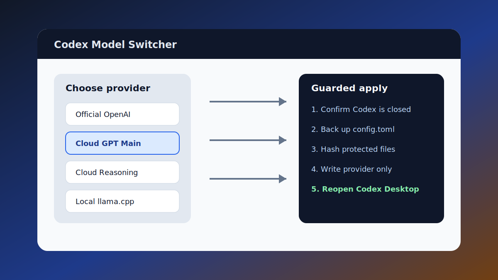
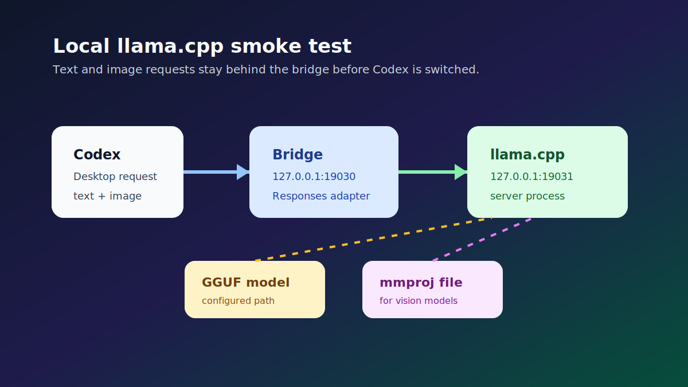

# Demo Gallery

This gallery contains sanitized, generated visuals that explain the intended
user flow. They are not screenshots from a private machine, and they do not
contain real providers, endpoints, tokens, local paths, model files, or account
state.

## Guarded Dry-run

Preview the planned Codex provider change before writing anything:

What this demonstrates:

- the user sees a redacted diff first
- `config.toml` is the only planned write target
- provider hostnames are hidden
- no account, cache, or session files are modified during dry-run

Related docs:

- [`quickstart-demo.md`](quickstart-demo.md)
- [`private-config-dryrun.md`](private-config-dryrun.md)
- [`safety.md`](safety.md)

## Windows Switcher Flow

The Windows flow is intentionally guided: pick a provider, confirm Codex is
closed, apply the guarded change, then reopen Codex.

What this demonstrates:

- model switching happens outside Codex's bottom-right menu
- Codex Desktop should be closed before config writes
- protected files are checked before and after a real switch
- the launcher should remain boring and recoverable

Related docs:

- [`windows-user-flow.md`](windows-user-flow.md)
- [`windows-cloud-canary.md`](windows-cloud-canary.md)
- [`windows-second-canary.md`](windows-second-canary.md)

## Local llama.cpp Smoke Test

Local model support is optional. It should be tested before Codex is switched to
the local provider.

What this demonstrates:

- Codex talks to the local bridge
- the bridge talks to llama.cpp
- multimodal models need both GGUF and mmproj paths
- local model failures are environment-specific and should not block cloud
  provider setup

Related docs:

- [`local-llama-smoke.md`](local-llama-smoke.md)
- [`architecture.md`](architecture.md)
- [`recovery.md`](recovery.md)

## Reusing These Images

These images are safe for README, release notes, posts, and presentations. If
you create real screenshots for a blog post, remove or blur:

- provider hosts
- keys or tokens
- personal account details
- private file paths
- LAN IPs
- conversation contents
